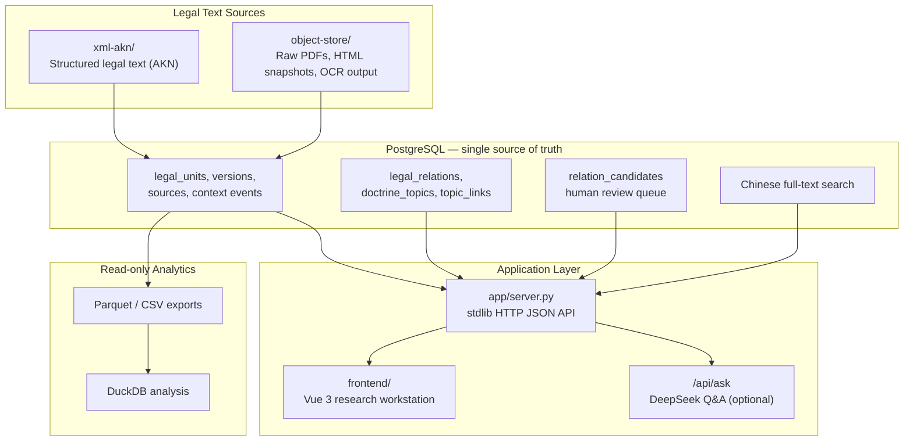

<div align="center">

# ⚖️ Legal Corpus

**A versioned legal & policy-history knowledge base — PostgreSQL-backed corpus, evidence-graded claims, and a Vue research workstation**


</div>

---

## 📖 Table of Contents

- [Introduction](#-introduction)
- [Architecture](#-architecture)
- [Core Features](#-core-features)
- [Tech Stack](#️-tech-stack)
- [Quick Start](#-quick-start)
- [Project Structure](#-project-structure)
- [Testing](#-testing)
- [Roadmap](#️-roadmap)
- [Documentation](#-documentation)
- [Disclaimer](#️-disclaimer)
- [License](#-license)

---

## 🌟 Introduction

Legal Corpus is the database foundation for a **legal and policy-history corpus**. The first anchored corpus is mainland China's **Company Law** — all seven formal versions (1993–2023) at article-level granularity — but the storage model is built as a broader **legal-system base**: related laws, regulations, doctrine topics, and policy background are recorded as independent, interlinked nodes.

The design answers three problems that flat legal-text archives cannot:

- **Version drift** — every formal amendment is a first-class node, so cross-version comparison (e.g. 2018 vs 2023, article by article) is a query, not a manual diff.
- **Unverifiable claims** — statements like "the Company Law learned from Singapore company law" are stored only as *evidence-graded claims* with a source record, an evidence level, and an explicit confidence — never as unconditional facts.
- **Opaque graph growth** — model- or human-proposed relations land in a review queue and must carry source evidence before they are accepted into the formal relation graph.

---

## 🏗 Architecture

PostgreSQL is the only mutable source of truth. XML and raw files live outside the database and are referenced by URI. DuckDB reads exported data for analysis; it is not an application database.



---

## ⚡ Core Features

| Feature | Description |
|---|---|
| 📜 Seven-version Company Law corpus | All formal mainland versions — 1993, 1999, 2004, 2005, 2013, 2018, 2023 — stored as article-level `legal_units` with per-version metadata |
| 🕸️ Legal-system knowledge graph | `legal_domains`, `legal_relations` (`based_on`, `specifies`, `constrained_by`, `policy_background`, …), `doctrine_topics`, and `topic_links` connect instruments, articles, and context events |
| 🔍 Evidence-graded claims | Every historical or comparative-law claim carries `claim_text`, `source_id`, `evidence_level`, and `confidence` in `context_links` |
| ✅ Human-in-the-loop review queue | `relation_candidates` hold proposed graph edges; accept / reject / edit endpoints return the full refreshed queue bundle in one call |
| 🇨🇳 Chinese full-text search | `sql/007_chinese_fts.sql` plus `/api/search` and `/api/workspace/search` endpoints |
| 🖥️ Vue research workstation | Graph explorer (vis-network), review queue, article readers, cross-version compare view, and topic / domain / instrument browsers |
| 🤖 Optional LLM Q&A | `/api/ask` builds context from the catalog, version timeline, cross-law relations, and evidence, then answers via DeepSeek when `DEEPSEEK_API_KEY` is set |

---

## 🛠️ Tech Stack

| Layer | Technology | Notes |
|---|---|---|
| Database | PostgreSQL | Sole mutable source of truth; schema & seeds in `sql/001`–`007` |
| Backend | Python 3 stdlib (`http.server`) | JSON `/api/*` endpoints; queries PostgreSQL through the `psql` CLI — no Python DB driver required |
| Frontend | Vue 3.5 + TypeScript 5.6 + Vite 5.4 | SPA research workstation; vis-network for graph exploration |
| Analytics | DuckDB | Read-only analysis over exported Parquet/CSV (`analysis/`) |
| Legal text | XML / Akoma Ntoso | Immutable structured legal text in `xml-akn/` |
| LLM (optional) | DeepSeek API | Enabled via `DEEPSEEK_API_KEY` / `DEEPSEEK_MODEL` |

---

## 🚀 Quick Start

**Prerequisites:** PostgreSQL with the `psql` client, Python 3, Node.js + npm.

### 1. Bootstrap the database

Run the SQL scripts from the repository root, in this order:

```bash
createdb legal_corpus
psql -d legal_corpus -f sql/001_schema.sql
psql -d legal_corpus -f sql/002_seed_company_law.sql
psql -d legal_corpus -f sql/004_legal_system_base.sql
psql -d legal_corpus -f sql/005_topics_and_explanations.sql
psql -d legal_corpus -f sql/006_graph_review_stack.sql
psql -d legal_corpus -f sql/007_chinese_fts.sql
psql -d legal_corpus -f sql/003_validation_queries.sql
```

The backend talks to PostgreSQL through `psql`, so point the standard `PG*` environment variables at your database, e.g.:

```bash
export PGHOST=127.0.0.1
export PGPORT=5432
export PGDATABASE=legal_corpus
export PGUSER=legal_corpus
export PGPASSWORD=legal_corpus_dev
```

### 2. Run the backend

```bash
python3 app/server.py   # http://127.0.0.1:8000
```

> The root `main.py` is a placeholder stub (it only prints a startup banner) — the real application entrypoint is `app/server.py`. Host and port can be overridden with `LEGAL_CORPUS_HOST` / `LEGAL_CORPUS_PORT`.

### 3. Run the frontend (development)

Two ports: the backend serves the API, Vite serves the UI and proxies `/api/*`.

```bash
cd frontend
npm install
npm run dev             # http://127.0.0.1:5173
```

### 4. Production (single port)

Build the frontend into `app/static/` (generated, not committed), then run only the Python server — it serves the SPA with an `index.html` fallback so client-side routes survive a hard refresh:

```bash
cd frontend && npm run build
cd .. && python3 app/server.py   # http://127.0.0.1:8000
```

### 5. Optional: LLM Q&A

```bash
export DEEPSEEK_API_KEY=...
export DEEPSEEK_MODEL=deepseek-v4-flash
python3 app/server.py
```

### API overview

Aggregated workspace endpoints — each returns everything one SPA route needs in a single call, with labels, hrefs, and groupings pre-resolved server-side:

```text
GET  /api/workspace/home
GET  /api/workspace/search?q=注册资本
GET  /api/workspace/graph?node_key=legal_unit:company_law:2023:article_47
GET  /api/workspace/reader?version=cn_company_law_2023&article=47
GET  /api/workspace/instrument-reader?slug=cn_civil_code&unit=61
GET  /api/workspace/compare?left=cn_company_law_2018&right=cn_company_law_2023&article=47
GET  /api/workspace/instrument?slug=cn_company_law
GET  /api/workspace/domain?slug=commercial-organization
GET  /api/workspace/topic?slug=capital-credit
GET  /api/workspace/review?status=pending
POST /api/workspace/review/candidate/accept   {candidate_id, status}
POST /api/workspace/review/candidate/reject   {candidate_id, review_note, status}
POST /api/workspace/review/candidate/edit     {candidate_id, relation_type, claim_text, confidence, review_note, status}
```

Lower-level raw endpoints for scripting/debugging: `/api/stats`, `/api/versions`, `/api/contexts`, `/api/sources`, `/api/search`, `/api/evidence/excerpts`, `/api/graph/node`, `/api/graph/neighbors`, `/api/graph/path`, plus `POST /api/agent/extract-relations` and `POST /api/ask`.

---

## 📁 Project Structure

```text
legal-corpus/
├── sql/                        # PostgreSQL schema, seeds, validation, FTS
│   ├── 001_schema.sql
│   ├── 002_seed_company_law.sql
│   ├── 003_validation_queries.sql
│   ├── 004_legal_system_base.sql
│   ├── 005_topics_and_explanations.sql
│   ├── 006_graph_review_stack.sql
│   └── 007_chinese_fts.sql
├── app/                        # Python stdlib backend
│   ├── server.py               # HTTP server + routing (real entrypoint)
│   ├── db_access.py            # psql-based query access
│   ├── graph_service.py        # graph node / neighbors / path
│   ├── review_service.py       # review queue accept / reject / edit
│   ├── workspace_service.py    # aggregated /api/workspace/* views
│   ├── query_defs.py           # SQL query definitions
│   ├── agent_service.py        # relation-candidate extraction
│   └── llm_support.py          # DeepSeek Q&A support
├── frontend/                   # Vue 3 + Vite research workstation (SPA)
│   └── src/                    # api / components / composables / router / views
├── analysis/                   # DuckDB analysis SQL over exports
├── xml-akn/                    # Structured legal text (Akoma Ntoso XML)
├── object-store/               # Raw PDFs, HTML snapshots, OCR output
├── docs/                       # Research & design notes
├── main.py                     # Placeholder stub (see Quick Start)
└── requirements.txt            # Optional Python deps (lxml, pydantic, …)
```

---

## 🧪 Testing

There is no automated test suite yet. Current validation relies on:

```bash
# Database sanity checks (row counts, referential integrity, seed coverage)
psql -d legal_corpus -f sql/003_validation_queries.sql

# Frontend static type check (runs as part of the production build)
cd frontend && npm run build   # vue-tsc --noEmit && vite build
```

---

## 🗺️ Roadmap

- [x] Seven formal Company Law versions (1993–2023) seeded at article level
- [x] Legal-system base: domains, instrument mapping, cross-law relations, doctrine topics, plain-language explanations
- [x] Graph review stack with evidence-gated candidate acceptance
- [x] Chinese full-text search
- [x] Vue 3 research workstation (graph explorer, readers, compare, review queue)
- [x] Optional DeepSeek Q&A endpoint
- [ ] Replace wiki/professional-site full texts (1993–2004, 2013, 2018) with official/gazette sources
- [ ] Paragraph/item-level legal units via the same `legal_units` table
- [ ] Publish the article import pipeline (currently a local-only script)
- [ ] Automated test suite (backend API + frontend)
- [ ] Broaden instrument coverage beyond the first wave (Constitution, Civil Code, Securities Law, Enterprise Bankruptcy Law, Market Entity Registration Regulation, State-owned Assets Law, Foreign Investment Law, Partnership Enterprise Law, Sole Proprietorship Law)

---

## 📚 Documentation

| Document | Description |
|---|---|
| [Graph Libraries Research](docs/graph-libraries-research.md) | Evaluation of graph-visualization libraries behind the frontend explorer |

---

## ⚠️ Disclaimer

This project is a **research and knowledge-management tool**. The corpus, graph relations, and any LLM-generated answers are provided for research purposes only and **do not constitute legal advice**. Some seeded full texts are transcribed from non-official sources and are pending replacement with official/gazette versions — always verify against authoritative publications before relying on any content.

---

## 📄 License

Distributed under the [MIT License](LICENSE). Copyright (c) 2026 CHINGBOH.

---

<div align="center">

**[⬆ Back to Top](#️-legal-corpus)**

</div>
